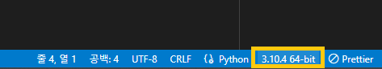
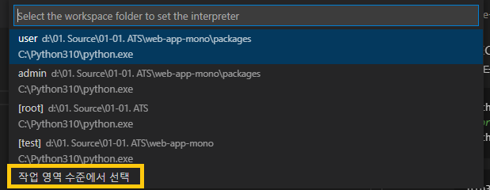
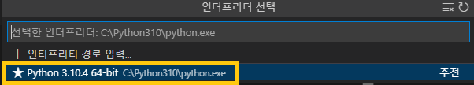
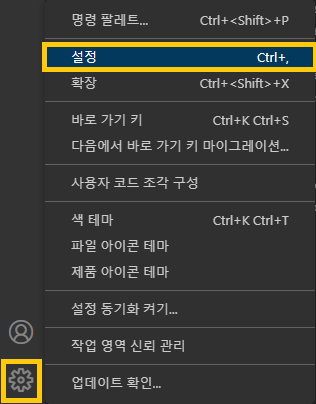
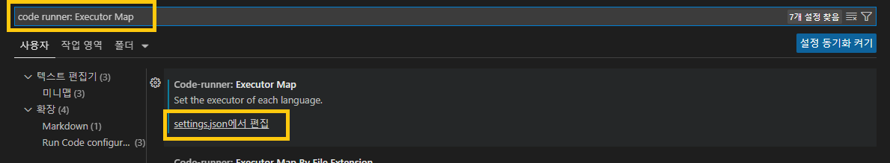

# ATS_PROJECT web test by selenium

1. [test] terminal 열어서 아래 명령어 입력

   ```bash
   python3 -m venv .venv
   # or
   Python -m venv .venv
   ```

1. powershell 관리자 권한으로 열어서 아래 명령어 입력

   ```bash
   pip install selenium
   ```

   ```bash
   pip install webdriver-manager
   ```

1. sample.py 파일 열기

1. VSCode Python 버젼 선택

   

1. "작업영역 수준에서 선택" 클릭

   

1. C 드라이브 Python 선택

   

1. VSCode 설정

   

1. "code runner: Executor Map" 검색

   ```bash
   code runner: Executor Map
   ```

   

1. python 값 "set PYTHONIOENCODING=utf8 && python -u"로 변경

   ```bash
   set PYTHONIOENCODING=utf8 && python -u
   ```

   
